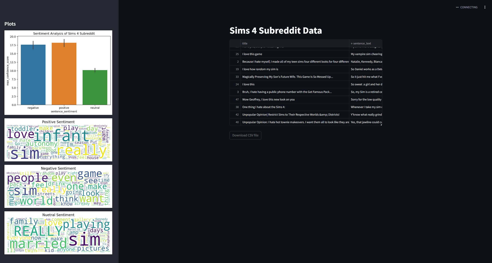

# About My Project

Student Name:  Kezia Regis
Student Email:  knregis@syr.edu

### What it does
This project will use the reddit api and azure sentiment api to compile negative, positive, and neutral aspects about the sims 4 game from posts made by Sims 4 players. Using the data obtained from the api I will use seaborn and pandas to visualize the data. There will be tests for  Api_calls.py and Sentiment.py

### How you run my project
The final project will be shown through a streamlit dashboard in Visual.py. It will contain a plot and wordmaps

### Other things you need to know
